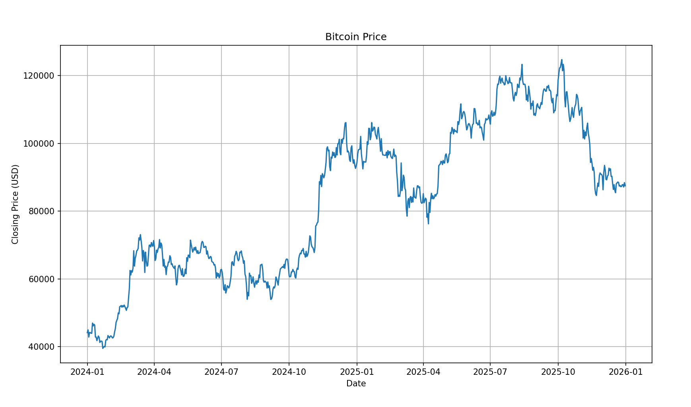
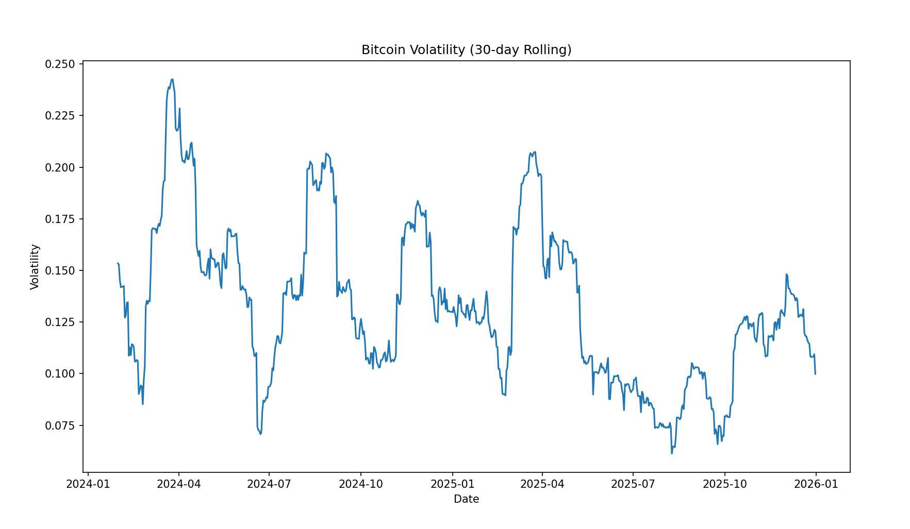
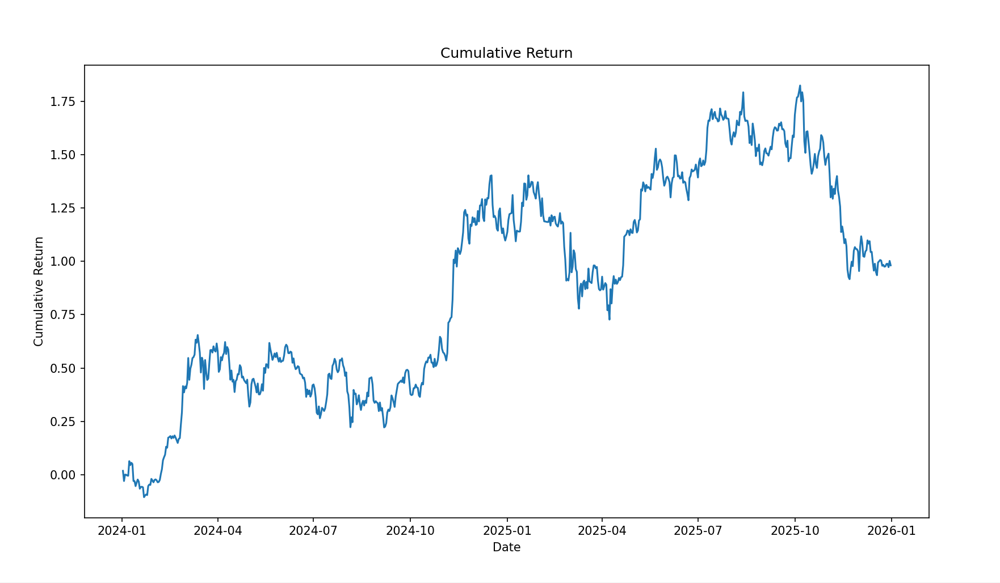
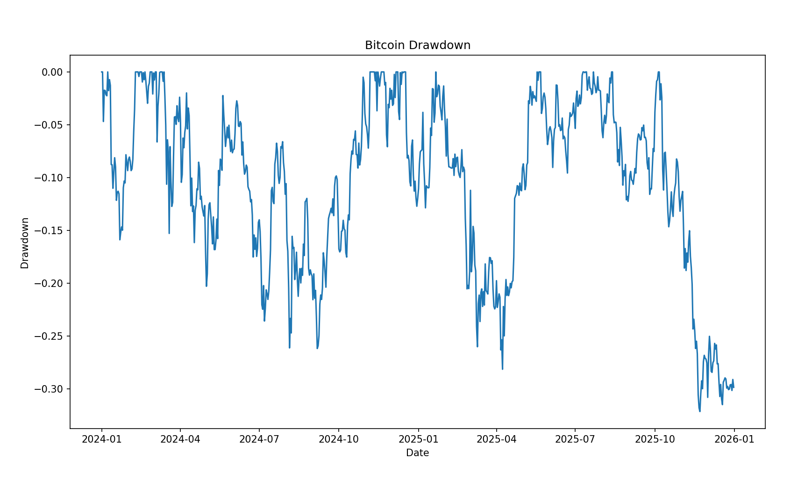
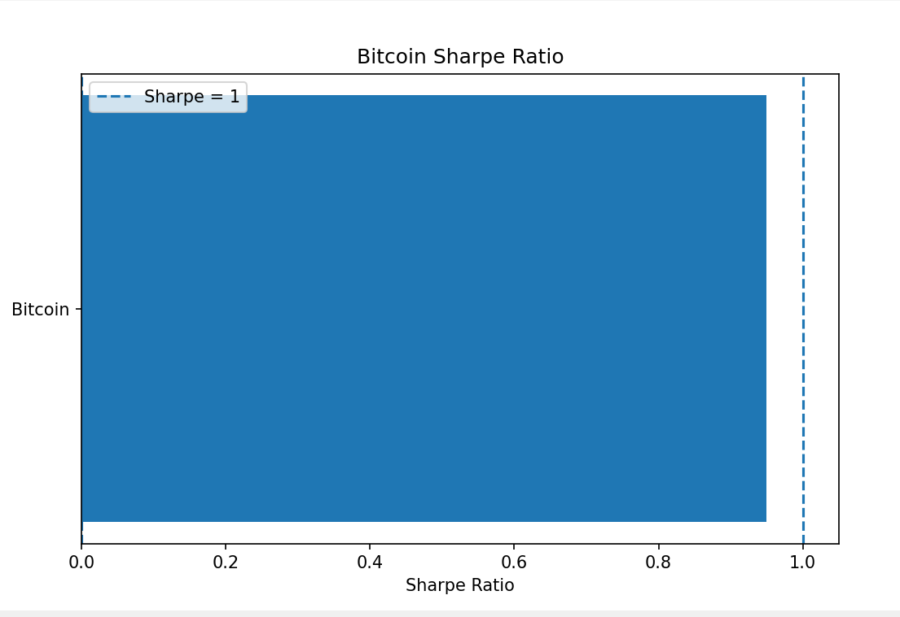
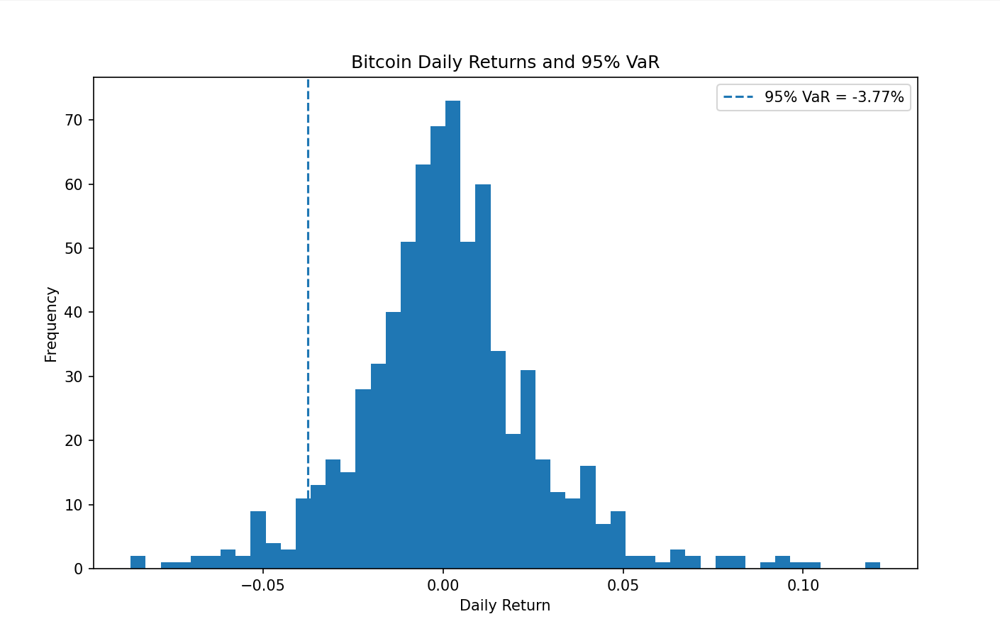

# Crypto Volatility & Risk Analyzer

A Python-based cryptocurrency analysis tool that uses historical Bitcoin market data to analyze performance, volatility, and financial risk.

## Features

- Fetches historical Bitcoin data using `yfinance`
- Calculates daily returns
- Calculates 30-day rolling volatility
- Calculates cumulative return
- Calculates maximum drawdown
- Calculates average daily return
- Calculates Sharpe Ratio
- Calculates 95% Value at Risk (VaR)
- Generates visualizations for the calculated measurements

## Technologies Used

- Python
- Pandas
- NumPy
- Matplotlib
- yfinance

## Project Structure

```text
Crypto Volatility & Risk Analyzer 2026/
|
|- analyzer.py
|- requirements.txt
|- README.md
|- showcase/
   |- bitcoin_price.png
   |- volatility.png
   |- cumulative_return.png
   |- drawdown.png
   |- sharpe_ratio.png
   |- var.png
```

## Requirements
```text
Python 3.x
Internet connection
```

## Installation 

### 1. Clone the repository
git clone https://github.com/kavyanjali2025/Crypto-Volatility-Risk-Analyzer

### 2. Open the project folder
cd "Crypto Volatility & Risk Analyzer 2026"

### 3. Install the required libraries
pip install -r requirements.txt

## Usage
Run the analyzer using:
```text
python analyzer.py
```
The program fetches historical Bitcoin data and calculates different performance and risk measurements.

## Measurements

### Daily Return

Measures the percentage change in Bitcoin's closing price from one day to the next.

**Formula:**

Daily Return = (Today's Close - Previous Close) / Previous Close

### 30-Day Rolling Volatility

Measures how much Bitcoin's daily returns fluctuate over a 30-day period.

**Formula:**

30-Day Volatility = Standard Deviation of 30-Day Returns × √365

### Cumulative Return

Measures the total compounded return over the selected period.

**Formula:**

Cumulative Return = Product of (1 + Daily Return) - 1

### Maximum Drawdown

Measures the largest decline in Bitcoin's price from a previous peak.

**Formula:**

Drawdown = (Current Price - Previous Peak) / Previous Peak

### Average Daily Return

Measures the average percentage return per day.

**Formula:**

Average Return = Mean of Daily Returns

### Sharpe Ratio

Measures the return earned relative to the amount of volatility taken.

**Formula:**

Sharpe Ratio = (Average Return / Standard Deviation) × √365

### Value at Risk (VaR)

The 95% VaR identifies the historical daily-return threshold below which approximately 5% of observations fall.

**Calculation:**

95% VaR = 5th Percentile of Daily Returns

## Visualizations

### Bitcoin Price

Shows the historical closing price of Bitcoin over the selected period.



### 30-Day Rolling Volatility

Shows how Bitcoin's price fluctuation changes over time.



### Cumulative Return

Shows the overall compounded return of Bitcoin over the selected period.



### Maximum Drawdown

Shows the decline in Bitcoin's price from its previous peak.



### Sharpe Ratio

Shows Bitcoin's risk-adjusted return, where a higher value generally indicates better return relative to volatility.



### 95% Value at Risk (VaR)

Shows the historical daily-return distribution and the 95% VaR threshold representing the boundary of the worst 5% of historical returns.



## Analysis Workflow

The project analyzes Bitcoin from both performance and risk perspectives.

### Step 1: Collect Market Data

Historical Bitcoin price data is collected using `yfinance`.

### Step 2: Calculate Returns

Daily returns are calculated from the closing prices to understand how Bitcoin's value changes from one day to the next.

### Step 3: Measure Volatility

30-day rolling volatility is calculated to identify periods of relatively high and low market fluctuations.

### Step 4: Evaluate Performance

Cumulative return and average daily return are calculated to understand Bitcoin's overall and typical performance during the selected period.

### Step 5: Measure Risk

Maximum drawdown identifies the largest fall from a previous peak. Sharpe Ratio evaluates returns in relation to volatility, while VaR estimates the historical threshold for extreme daily losses.

### Step 6: Visualize the Results

The calculated metrics are represented using charts to make price trends, volatility, performance, and risk easier to compare and interpret.

### Step 7: Draw Insights

The measurements are considered together to understand the relationship between Bitcoin's returns, volatility, and downside risk.

## Limitations

- The analysis relies on historical Bitcoin market data.
- Historical patterns may not represent future market behavior.
- VaR does not account for every possible extreme market event.
- The Sharpe Ratio uses a simplified risk-free rate assumption.
- Cryptocurrency prices can be affected by sudden market events and high volatility.

## Disclaimer

This project is created for educational and portfolio purposes only. The analysis is based on historical data and should not be considered financial or investment advice.
